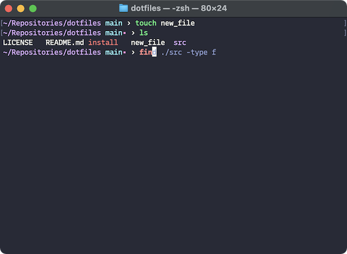

# dotfiles



## Requirements

- [Homebrew](https://brew.sh)
- [macOS](https://www.apple.com/macos/)
- [Zsh](http://zsh.sourceforge.net) (native or installed via Homebrew)

## Install

Clone or download repository and run `install.sh`.

## Notes

- To fix `zsh compinit: insecure directories, run compaudit for list.`, run:

  ```sh
  compaudit | xargs chmod g-w
  ```

  See: https://stackoverflow.com/a/22753363
